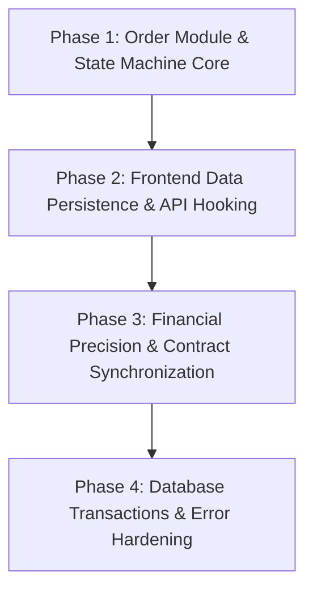

# Som Sing Phim ERP — System Improvement & Phased Execution Plan

เอกสารฉบับนี้รวบรวมรายการปัญหา ข้อบกพร่องทางสถาปัตยกรรม และแผนการปรับปรุงระบบ Som Sing Phim ทั้งหมด โดยแบ่งออกเป็นเฟส (Phased Implementation) พร้อม Prompt Template สำหรับสั่งงานแต่ละสเต็ปอย่างเป็นระบบ เพื่อลดความผิดพลาดในการเขียนโค้ด

---

## 📑 Issue & Remediation Matrix

| รหัส | ความรุนแรง | รายการปัญหา | โมดูลที่เกี่ยวข้อง | เฟสที่แก้ไข |
|:---|:---:|:---|:---|:---:|
| **ISSUE-01** | 🔴 Critical | ขาด Order Domain & State Machine (QUOTATION -> IN_PRODUCTION -> COMPLETED) | Backend (domain/service/handler/repo) | **Phase 1** |
| **ISSUE-02** | 🔴 Critical | Frontend Verification Page ใช้ Mock Data ไม่ Persist ผ่าน API จริง | Frontend (`OrderDetailVerificationPage.tsx`) | **Phase 2** |
| **ISSUE-03** | 🔴 Critical | Frontend คำนวณราคาด้วย `number (float64)` ใน Client-side | Frontend (`handleSubmitOverride`) | **Phase 2 & 3** |
| **ISSUE-04** | 🟡 Medium | Type Mismatch ระหว่าง `InternalOrderPricing` (TS) และ `InternalCostAudit` (Go) | Frontend/Backend Contract | **Phase 3** |
| **ISSUE-05** | 🟡 Medium | `IntakeInkBottle` ไม่ได้ทำงานภายใต้ Database Transaction | Backend (`inventory_service.go`) | **Phase 4** |
| **ISSUE-06** | 🟡 Medium | `drive_ingestion_worker` ละเลย Error จาก `updateJobStatus` | Backend (`drive_ingestion_worker.go`) | **Phase 4** |
| **ISSUE-07** | 🟡 Medium | ขาด Endpoint `PUT /api/v1/pricing/templates/:id` สำหรับแก้ไข Template | Backend (`pricing_handler.go`) | **Phase 3** |
| **ISSUE-08** | 🟢 Minor | `InboundDate` ใน Go struct เป็น `string` แทน `time.Time` | Backend (`domain/inbound.go`) | **Phase 4** |
| **ISSUE-09** | 🟢 Minor | Route ซ้ำซ้อน `/api/v1/materials` vs `/api/v1/inventory/materials` | Backend (`inventory_handler.go`) | **Phase 4** |
| **ISSUE-10** | 🟢 Minor | ขาด Custom Hooks สำหรับ Fetch ข้อมูลผ่าน TanStack Query | Frontend (`src/hooks/`) | **Phase 2** |

---

## 🚀 แผนการดำเนินงานรายเฟส (Phased Roadmap)



---

### 📦 Phase 1: Order Module & State Machine Core (Backend)

**เป้าหมาย:** สร้างระบบจัดการคำสั่งซื้อ (Orders) ให้ครบวงจรตามกฎ `admin-architecture-guard.md` และ `go-backend-persistence.md`

#### สเต็ปย่อย:
1. **Step 1.1 - Domain Model (`backend/internal/domain/order.go`):**
   - กำหนด Enum `OrderStatus`: `QUOTATION`, `PENDING_PAYMENT`, `ORDER_CREATED`, `FILE_CONFIRMED`, `IN_PRODUCTION`, `COMPLETED`, `CANCELLED`
   - กำหนด Struct `Order`, `OrderItem`, `OrderStatusHistory`, `OverridePricingRequest`
   - ใช้ `decimal.Decimal` สำหรับฟิลด์การเงินทั้งหมด
2. **Step 1.2 - Repository Layer (`backend/internal/repository/order_repository.go`):**
   - CRUD Orders และ Order Items ด้วย DB Transactions
   - Query ค้นหาตาม ID, Order Number, Status
   - อัปเดตสถานะพร้อมบันทึกประวัติการเปลี่ยนสถานะ
3. **Step 1.3 - Service Layer (`backend/internal/service/order_service.go`):**
   - จัดการ State Transition Guard (ห้ามเปลี่ยนสถานะข้ามขั้นผิดกฎ)
   - จุดตัดสต็อกอัตโนมัติเมื่อสถานะเปลี่ยนเป็น `IN_PRODUCTION`
   - คำนวณ Spoilage และบันทึกของเสีย
4. **Step 1.4 - Handler & Routes (`backend/internal/handler/order_handler.go`):**
   - `GET /api/v1/orders`
   - `GET /api/v1/orders/:id`
   - `POST /api/v1/orders`
   - `PATCH /api/v1/orders/:id/status`
   - `POST /api/v1/orders/:id/override-pricing`

---

### 🌐 Phase 2: Frontend Data Persistence & API Hooking

**เป้าหมาย:** เปลี่ยนหน้า Pre-flight Verification และ Order Details จาก Mock data เป็น Real-time API integration

#### สเต็ปย่อย:
1. **Step 2.1 - React Query Hooks (`somsingphim/src/hooks/useOrders.ts`):**
   - `useOrderVerification(orderId)`
   - `useUpdateOrderStatus()`
   - `useOverridePricing()`
   - กำหนด Cache Invalidation เมื่อเกิดการ Mutation
2. **Step 2.2 - ปรับปรุง `OrderDetailVerificationPage.tsx`:**
   - นำ Mock Data ออก แล้วเชื่อมต่อกับ `useOrderVerification(id)`
   - เพิ่ม State จัดการ Loading และ Error (Skeleton Screen / Error Alert)
   - ส่งคำขอ Override Pricing ไปยัง Backend API แทนการคำนวณในหน่วยความจำ
3. **Step 2.3 - Global Feedback & Toast Notification:**
   - แสดงผลสถานะสำเร็จ/ล้มเหลวแบบ Realtime

---

### 💰 Phase 3: Financial Precision & Contract Synchronization

**เป้าหมาย:** ซิงค์ Interface ระหว่าง Frontend TypeScript และ Go Backend ให้ตรงกัน 100% พร้อมขจัดปัญหา Client-side float rounding

#### สเต็ปย่อย:
1. **Step 3.1 - ซิงค์ Interface Types (`somsingphim/src/types/`):**
   - ปรับ `InternalOrderPricing` ใน TS ให้ฟิลด์ตรงกับ `InternalCostAudit` และ `OrderItemCostBreakdown` ใน Go
   - ซิงค์โครงสร้าง `ProductPricingTemplate` และ `AddonRates`
2. **Step 3.2 - เพิ่ม Template Edit Endpoint ใน Backend:**
   - `PUT /api/v1/pricing/templates/:id` ใน `pricing_handler.go` และ `pricing_service.go`
3. **Step 3.3 - ปรับ Logic คำนวณราคา Override ใน Frontend:**
   - ส่ง Parameter `override_unit_price`, `reason`, `approved_by` ไปคำนวณที่ Go Backend แล้วรับผลลัพธ์ที่เป็น Exact Decimal กลับมาแสดงผล

---

### 🛡️ Phase 4: Database Transactions & Error Hardening

**เป้าหมาย:** ตรวจสอบความปลอดภัย ความทนทาน และ Clean Architecture ของ Go Backend

#### สเต็ปย่อย:
1. **Step 4.1 - เพิ่ม Transaction ใน Ink Intake:**
   - แก้ไข `IntakeInkBottle` ใน `inventory_service.go` ให้ครอบด้วย `s.db.BeginTx()`
2. **Step 4.2 - แก้ไข Worker Error Handling:**
   - ตรวจจับ error จาก `updateJobStatus` ใน `drive_ingestion_worker.go` พร้อม Log รายละเอียด
   - นำ `workerID` มาใช้ประโยชน์ในการแท็ก Log
3. **Step 4.3 - ปรับปรุง Type วันที่และ Clean Routes:**
   - เปลี่ยน `InboundDate` ใน `StockInboundRecord` เป็น `time.Time` (หรือรองรับ RFC3339 parsing)
   - ตัด Duplicate Routes ใน `inventory_handler.go` ให้เป็น Standard RESTful

---

## 📝 Antigravity Prompts สำหรับนำไปสั่งงานแต่ละ Phase

คุณสามารถ Copy ข้อความ Prompt ด้านล่างนี้เพื่อสั่งงานทีละ Phase ได้ทันที:

### 🔹 Prompt สำหรับสั่งงาน Phase 1
```text
เริ่มทำ Phase 1: Order Module & State Machine Core ตามแผนใน .agents/task/system-remediation-plan.md
1. สร้าง domain/order.go กำหนด OrderStatus ตาม State Machine, Struct Order, OrderItem
2. สร้าง repository/order_repository.go รองรับ CRUD และ Transactions
3. สร้าง service/order_service.go จัดการ Transition Guard และตัดสต็อกอัตโนมัติเมื่อเข้า IN_PRODUCTION
4. สร้าง handler/order_handler.go พร้อมลงทะเบียน API Routes ที่ backend/server
ปฏิบัติตามกฎ admin-architecture-guard.md และ go-backend-persistence.md อย่างเคร่งครัด
```

### 🔹 Prompt สำหรับสั่งงาน Phase 2
```text
เริ่มทำ Phase 2: Frontend Data Persistence & API Hooking ตามแผนใน .agents/task/system-remediation-plan.md
1. สร้าง somsingphim/src/hooks/useOrders.ts โดยใช้ TanStack Query สำหรับ fetch และ mutate ข้อมูล Order
2. อัปเดต somsingphim/src/pages/admin/OrderDetailVerificationPage.tsx นำ Mock data ออกแล้วต่อกับ API จริง
3. ปรับ handleSubmitOverride ให้เรียก API Backend แทนการคำนวณ client-side float
```

### 🔹 Prompt สำหรับสั่งงาน Phase 3
```text
เริ่มทำ Phase 3: Financial Precision & Contract Synchronization ตามแผนใน .agents/task/system-remediation-plan.md
1. ซิงค์ interface ระหว่าง somsingphim/src/types/ กับ backend domain struct ให้ตรงกัน 100%
2. เพิ่ม Endpoint PUT /api/v1/pricing/templates/:id ใน pricing_service.go และ pricing_handler.go
3. ตรวจสอบการปัดเศษและการคำนวณเงินทั้งหมดให้เป็นไปตามกฎ Financial Precision
```

### 🔹 Prompt สำหรับสั่งงาน Phase 4
```text
เริ่มทำ Phase 4: Database Transactions & Error Hardening ตามแผนใน .agents/task/system-remediation-plan.md
1. แก้ไข IntakeInkBottle ใน inventory_service.go ให้ใช้ Database Transaction
2. จัดการ error handling และ logging ใน drive_ingestion_worker.go
3. ปรับปรุง InboundDate ให้ถูกต้อง และลบ Duplicate Route Aliases ใน inventory_handler.go
```
